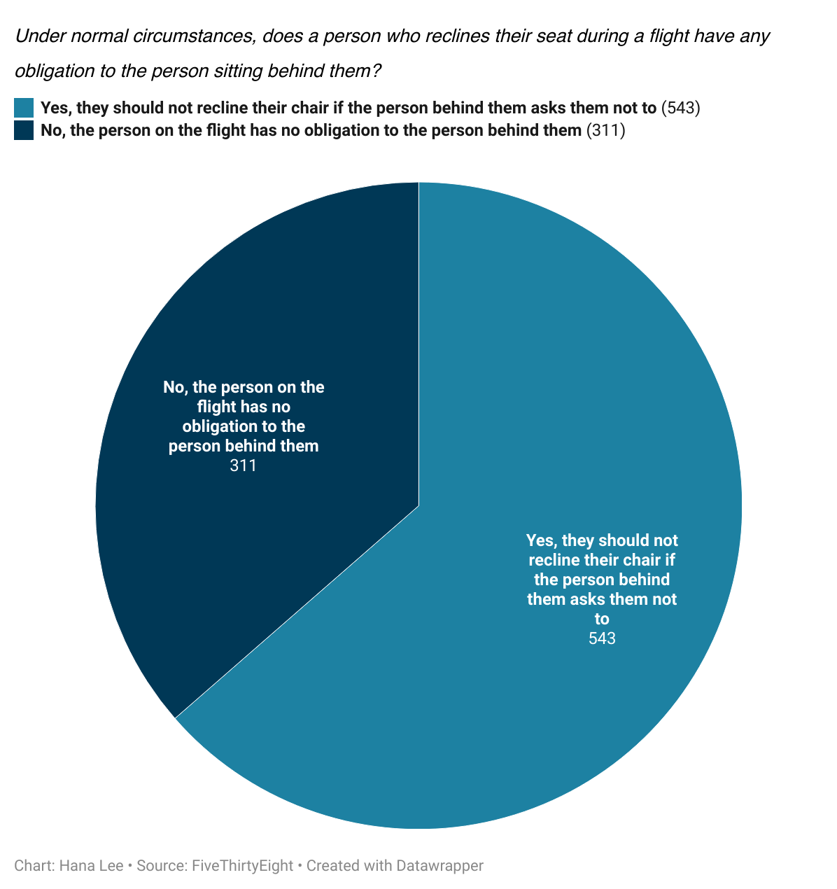

> I chose the question "Under normal circumstances, does a person who reclines their seat during a flight have any obligation to the person sitting behind them?" because I have always wondered what most people think about reclining the seat, as I've faced this situation many times before. I was surprised that the majority did follow "common sense" in the sense of having regard for others' personal space and boundaries for the opinionated questions in the dataset, but it was not the overwhelming majority. This can be seen in the chart below, where just over half (approximately 63%) of the people surveyed agreed that "Yes, they should not recline their chair if the person behind them asks them not to".

